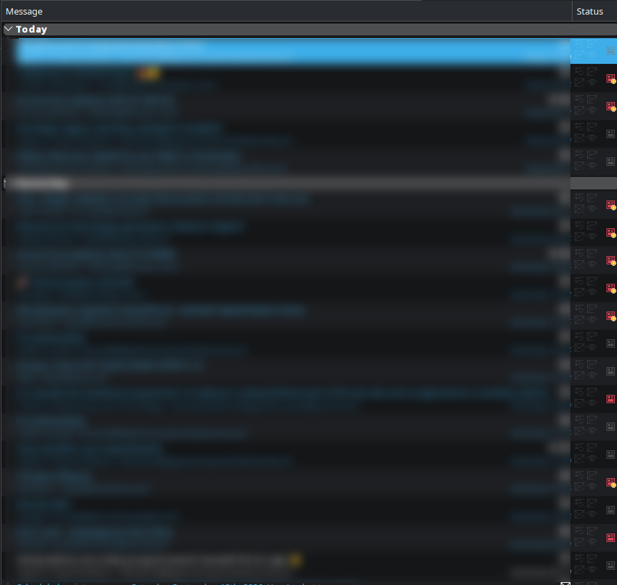
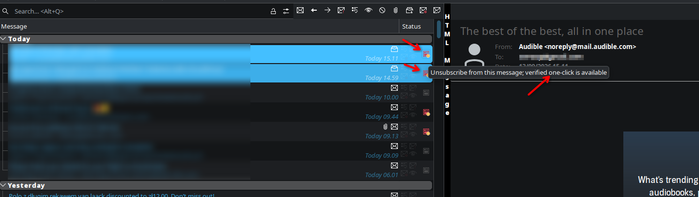
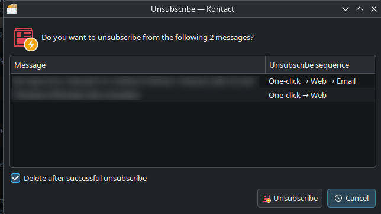

# Unsubscribe for KMail

Adds an **Unsubscribe** action to KMail and Kontact. It works with one message or
**multiple selected messages at once**, combining authenticated
[RFC 8058](https://www.rfc-editor.org/rfc/rfc8058.html) one-click requests,
browser links, and unsubscribe emails. One confirmation shows what will happen
for every message. By default, successfully unsubscribed messages move to Trash.

## Install on Fedora 44

Clone the repository and run the setup script:

```bash
git clone https://github.com/snowkat/kmail_unsubscribe.git
cd kmail_unsubscribe
./setup.sh
```

The script installs the Fedora build dependencies, builds the three KMail
plugins, runs the tests, and installs them under `/usr/lib64/qt6/plugins`.
It uses `sudo` for package installation and the final system install, so it may
ask for your Linux login password. Fully quit and reopen Kontact and KMail when
the script finishes.

## Requirements

This was built using Qt6 and the following KDE Frameworks:

- extra-cmake-modules
- KConfig
- KCodecs
- KCoreAddons
- KGuiAddons
- KXmlGui
- KParts
- KIO
- KI18n

Additionally, the following KDE PIM libraries are required:

- KIdentityManagement
- Libkdepim
- MailCommon
- PimCommon
- Messagelib
- KPimTextEdit

## Build manually

If the dependencies are already installed, build and install directly with
CMake:

```bash
cmake -S . -B build -G Ninja -DCMAKE_BUILD_TYPE=Release \
  -DCMAKE_INSTALL_PREFIX=/usr -DBUILD_TESTING=ON
cmake --build build
ctest --test-dir build --output-on-failure
sudo cmake --install build
```

## Usage

### 1. Check the Status column

In the **Smart with Clickable Status** message-list theme, each message has an
unsubscribe icon in its **Status** column. The icon shows which methods are
available:

- **Red with a gold lightning badge:** verified one-click unsubscribe is available.
- **Red:** regular web or email unsubscribe is available.
- **Disabled gray:** no unsubscribe method is available.



Other message-list themes retain the toolbar, menu, and preview actions.

### 2. Select one or multiple messages

Select one message or **multiple messages at once** in the message list to
unsubscribe from several mailing lists with one confirmation.



### 3. Start unsubscribing

- **One message:** click its unsubscribe icon in the **Status** column.
- **Multiple messages:** select the messages, then **right-click > Unsubscribe**.

The toolbar's **Unsubscribe** action also works on all selected messages. The
action above the From/To header in the message preview or a separate message
window acts on that message only, just like its Status icon.

### 4. Review and confirm

The confirmation dialog lists every selected message's subject and unsubscribe
method sequence. Review the messages, then click **Unsubscribe** to proceed.
**Cancel** stops the entire operation before any unsubscribe request is sent;
use it to return to the message list and change your selection.

**Delete after successful unsubscribe** is checked by default and applies to
the whole selection. After a successful one-click response or a successfully
sent unsubscribe email, the original message moves to Trash. Uncheck the box
to keep the messages.



### 5. Review the results

The plugin automatically chooses the best available method for each message,
starting with **verified RFC 8058 one-click**, then **Web**, then **Email**.
A rejected one-click request falls back to the web page; if KMail cannot open
that page, it falls back to a valid unsubscribe email address.

When a one-click request is sent, a fallback is used, or a failure occurs, a
result summary shows what succeeded and what needs attention. Moves to Trash
are reported separately from unsubscribe failures. Other selected messages
continue processing if one fails.

If a website or email composer opens, finish the unsubscribe process there.
Opening a browser page or leaving an unsent draft does not confirm an
unsubscribe or delete the original message. Failed and skipped messages are
also kept.

## Unsubscribe behavior

In the message-list context menu, Unsubscribe is a direct entry with an icon. It replaces KMail's native email/web unsubscribe entries. The mailing-list submenu remains only when it contains other commands, such as Help or Archive.

Messages without an available method, including messages that could not be loaded, are marked as skipped in the confirmation. If no method remains after fetching the selected messages again, the plugin shows an error.

Deleted messages move to the account's Trash folder (or KMail's local Trash if the account uses it). Messages already in Trash stay there. Email cleanup happens only after KMail confirms sending.

Quick preparation goes straight to the confirmation. A cancelable “Checking unsubscribe methods…” dialog appears only when preparation lasts longer than 0.8 seconds.

Each preview or row icon reflects its own message. For a selection, the toolbar and menu action are enabled if any selected message has a method, and show the gold badge if any has verified one-click. Headers are fetched explicitly because KMail's message-list envelopes omit unsubscribe headers even when they report a loaded header payload. One-click checks run asynchronously, and clicking the action fetches and validates the selected messages again before asking for confirmation. Requests run sequentially after confirmation.

Email opens a composer with the identity and outgoing transport associated with the message's mailbox. The body contains only text explicitly requested by the mailing list and is otherwise empty; KMail's normal template and signature are removed. Malformed mailto: targets are skipped and never open a composer. When Email is available as a fallback, KMail makes a cookie-free HEAD request before opening a web page. HTTP 404, 410, and JSON responses fall through to Email without opening the browser; all other outcomes open the page normally. KMail does not fetch or interpret the page body. These methods require you to finish sending the email or using the website.

Email deletion consent is stored locally and consumed only by the prepared composer; it is never added to the outgoing email. Cleanup tracks that composer's exact outgoing items, waits for the mail dispatcher's successful Sent status, and continues after the composer closes. Merely queueing an email, saving a draft, or discarding an outgoing message keeps the original. Tracking lasts for the current KMail session; drafts reopened in another composer and configurations that discard sent copies have no verifiable completion for this tracking, so their originals are kept.

The gold badge verifies one-click headers and DKIM. A sender can still reject an old or unavailable unsubscribe address. HTTP errors such as 404 (Not Found) and 410 (Gone) are reported as unconfirmed unsubscribes, with the affected message subjects in the result details. Other selected messages continue processing. Try a newer message from that mailing list if its old link is no longer accepted.

## Testing

```bash
cmake -S . -B build -DBUILD_TESTING=ON
cmake --build build -j4
ctest --test-dir build --output-on-failure
```

To test a Fedora build from a staging directory, completely quit Kontact and any separate KMail windows with **File > Quit (Ctrl+Q)**, then run:

```bash
DESTDIR=/tmp/kmail-unsubscribe-stage-single-button cmake --install build --prefix /
bash ./run-staged-kontact.sh /tmp/kmail-unsubscribe-stage-single-button
```

Kontact is a single-instance application: starting it again while it is running reuses that process and its existing plugins. The launcher checks for this situation and records Qt startup messages in the staging directory's `kontact.log`. Closing a window can leave Kontact running in the system tray.

The optional native integration probe uses the installed KDE message-list and reader widgets and a running local Akonadi session. Supply an existing item ID with unsubscribe headers and one without them. It seeds the message list with synthetic text, verifies the toolbar/menu/row/preview behavior, and cancels the actual confirmation without sending emails or unsubscribe requests. The reader and confirmation can show the supplied items' real content or subjects, so local screenshots can contain that information. Its temporary configuration preserves only the Akonadi connection address.

```bash
cmake --build build --target unsubscribenativeprobe -j4
QT_QPA_PLATFORM=offscreen QT_PLUGIN_PATH="$PWD/build/bin" \
  ./build/bin/unsubscribenativeprobe LIST_ITEM_ID PLAIN_ITEM_ID
```

## License

See LICENSE.txt.
